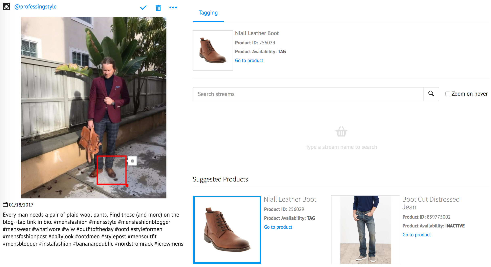

Stoppable ready component

This component allows to display an image that support annotations, managing the annotation data.



Example:
<op-annotable-img src="sample.jpg" width="200" height="300" annotation-data=“data” enable-editor-ui="false"
on-annotation-input-search-change="onSearchChange">

* **src**: image source. Image will be adapted by canvas width and height, but it will keep its aspect ratio.
* **width**: the width in px, default 450px
* **height**: the height in px, default 450px
* **enable-editor-ui**: true to allow users to create a hotspot by using mouse.
* **on-annotation-input-search-change**: a callback to be called when the user type on the search input
* **on-annotation-data-update**:  a callback to be called when an annotation
                            is being edited by using mouse gestures (move, resize, new annotation)
* **annotation-data**: arrays of objects containing all the hotspot data.
* **base-media-url**: base media url needed to get an image through a middleware. If this value is not passed the base64 crop functionality will not work. Default value is an empty string.

```[
    {
        "id": 1,
        "externalId": "Stream_1",
        "displayConfirmButton": true,
        "onConfirm": onConfirmCallback
        "displayRemoveButton": true,
        "onRemove": onRemoveCallback,
        "editable": false,
        "tooltip": {
            "text": "Image Text",
            "thumbnail": "thumbnail.jpg"
        },
        "geometry": {
            "type": "rectangle",
            "coordinates": {
                "x": 0.1,
                "y": 0.6
            }
            "size": {
                "height" : 0.2,
                "width" : 0.3
            }
        },
        getBase64Crop: Function
    }
]
```

* **id**: the autogenerated id
* **externalId**: optional, an id to identify the annotation with an external business entity
* **displayConfirmButton**: true to show a button for confirm action, default value: false
* **onConfirm**: a callback to be called on confirm action
* **displayRemoveButton**: true to show a button for remove action, default value: false
* **onRemove**: a callback to be called on remove action
* **editable**: true to allow user to resize and move the hotspot.
* **tooltip**: Information to display a tooltip linked with the hotspot, with a thumbnail and a text
* **geometry**: the coordinates an size of the hotspot. It is a value relative to the component source image size.
          i.e: a width size value 0.4 with a image source with width 200px means 80px width for the hotspot
* **getBase64Crop**: function called if you want to get a base64 image crop from the geometry data
