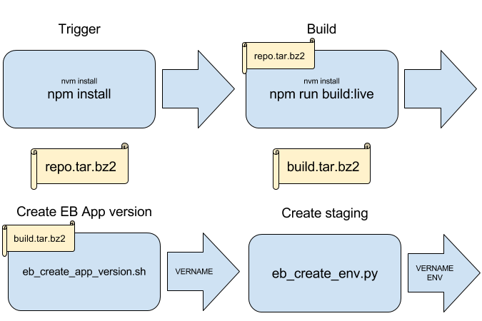
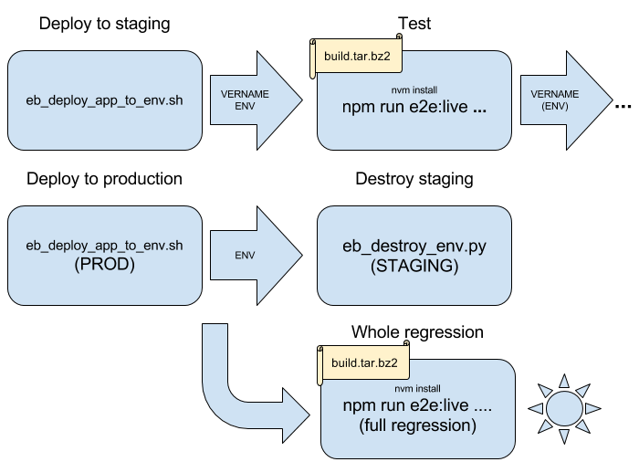

# Deployment
> Winter is coming. [*](quotes.md#deployment)

Every time a new TAG is created in the repository, a new build of the job ["LemuramaModSquad - Trigger"](https://tests.photorank.me/view/LemuramaModSquad%20-%20New%20Pipeline/job/LemuramaModSquad%20-%20Trigger/) is fired. You can visualize the complete pipeline [here](https://tests.photorank.me/view/LemuramaModSquad%20-%20New%20Pipeline/).
This task will execute the following sequence of jobs:

* **1. Trigger:**
    * Runs the command `npm install` which installs all the packages needed and [Project Dependencies](https://github.com/Olapic/LemuramaModsquad/blob/master/docs/project_dependencies.md). 
    * Also, it runs the unit tests, aborting the pipeline if these don't pass, right after executing `npm install`.
    * The outcome of this job is the artifact `repo.tar.bz2`.
* **2. Build:**
    * Receives the file `repo.tar.bz2` as input and generates the file `build.tar.bz2`, by executing `npm run build:live`.
* **3. Create EB App Version:**
    * Receives the file `build.tar.bz2` and uploads the content of its `dist/` directory to Amazon Elastic Beanstalk, as a new Application Version.
    * The Elastic Beanstalk Production Environment currently used by this project is [LemuramaMiddleware](https://console.aws.amazon.com/elasticbeanstalk/home?region=us-east-1#/environment/dashboard?applicationName=LemuramaMiddleware&environmentId=e-3mregmzx3u); for more information about how Elastic Beanstalk works check the [Elastic Beanstalk documentation](http://docs.aws.amazon.com/elasticbeanstalk/latest/dg/command-options-specific.html#command-options-nodejs).
* **4. Create Staging:**
    *  Creates a temporal staging environment that will be destroyed after the tests are successfully executed in further steps. The name of this environment is, for instance, `stg-v1610` if the version being released is `v1.6.10`. This is important to know when a pipeline fails and it's not expected to ever complete, because its temporary environment has to be destroyed manually, as pointed out below.
* **5. Deploy to Staging:**
    *  Deploys an application version into the staging environment created before.
* **6. Tests Execution:**
    *  A series of jobs will be run to execute individual test suites. In particular,
        * A job will execute the command `npm run e2e:live --tags @smoke` to run our smoke automated suite. This test suite verifies that the critical behaviour of the application is working.
        * Then, another job will execute the command `npm run e2e:live --tags @sanity` to run our sanity automated suite.
* **7. Deploy to Production:**
    *  Deploys the application version previously uploaded into the production environment.
* **8. Destroy Staging:**
    *  Destroys the STG environment previously created.
* **9. Regression Tests Execution:**
    *  This job will execute the command `npm run e2e:live --tags @regression` to run our regression automated suite.
    *  This test suite holds all the remaining automated tests that ensure nothing is broken after new features or issues have been added or fixed.

###Note to the reader
If a partially run pipeline is abandoned, whether because code or tests are broken, after the staging environment has been created, the pipeline will possibly not get to the point where the staging environment gets destroyed. It will be necessary for someone to periodically clean up those environments, by manually running some command or job.

